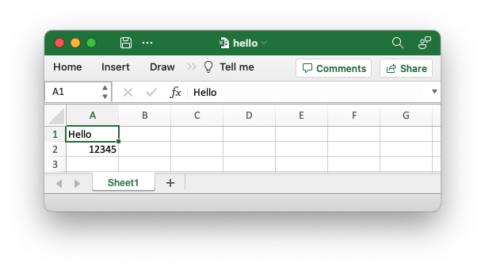

# Getting started

Rust_xlsxwriter is a library and doesn't need to be installed. All that is
required is to add it the `Cargo.toml` file for your project. To demonstrate we
will start with a small sample application.

## Create a sample application

Create a new rust command-line application as follows:

```bash
$ cargo new hello-xlsx
```


This will create a directory like the following:

```bash
hello-xlsx/
├── Cargo.toml
└── src
    └── main.rs
```

Change to the new `hello-xlsx` directory and add the `rust_xlsxwriter` dependency:

```bash
$ cd hello-xlsx
$ cargo add rust_xlsxwriter
```

Modify the `src/main.rs` file so it looks like this:

```rust
{{#rustdoc_include ../../rust_xlsxwriter/examples/app_hello_world.rs:8:}}
```

Then run the application as follows:

```bash
$   cargo run
```

This will create an output file called `hello.xlsx` which should look
something like this:


