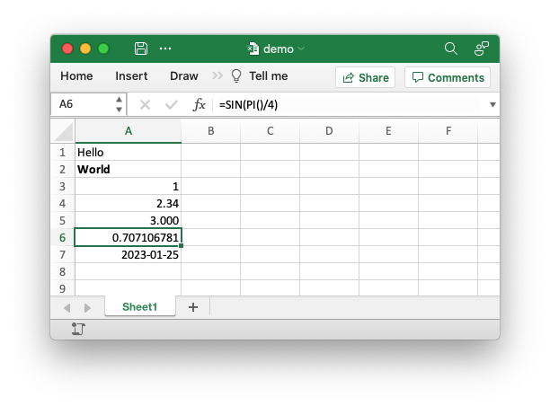

# rust_xlsxwriter

`rust_xlsxwriter` is a Rust library for writing Excel files in the XLSX format.

[Sample code to generate the Excel file shown above](examples/demo.md).

rust_xlsxwriter can be used to write text, numbers, dates and formulas to
multiple worksheets in a new Excel 2007+ XLSX file. It has a focus on
performance and on fidelity with the file format created by Excel. It cannot be
used to modify an existing file.

* [rust_xlsxwriter crate](https://crates.io/crates/rust_xlsxwriter)
* [rust_xlsxwriter API docs at docs.rs](https://docs.rs/rust_xlsxwriter/latest/rust_xlsxwriter/)
* [rust_xlsxwriter repository](https://github.com/jmcnamara/rust_xlsxwriter)
