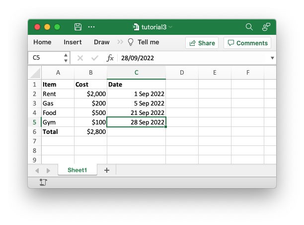

# Tutorial

Once you have the "hello world" application from the previous section working
you can try something more ambitious such as creating a spreadsheet to summarize
some monthly expenses like the following:

```rust,ignore
{{#include ../../../rust_xlsxwriter/examples/app_tutorial3.rs:12:17}}
```

And convert it to a worksheet like this:



