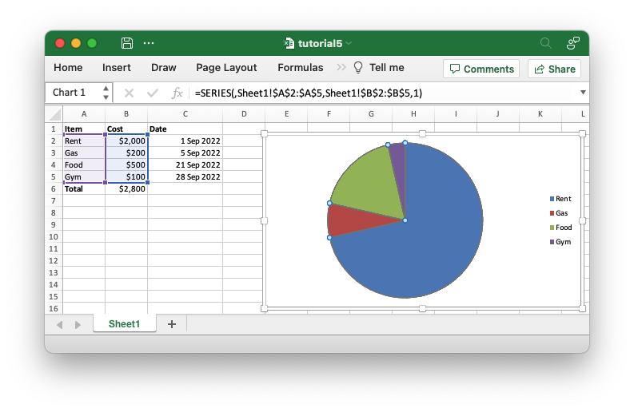

# Tutorial

Once you have the "hello world" application from the previous section working
you can try something more ambitious such as creating a spreadsheet to summarize
some monthly expenses like the following:

```rust
{{#rustdoc_include ../../../rust_xlsxwriter/examples/app_tutorial3.rs:13:18}}
```

And convert it to a worksheet like this:




## Reading ahead

The tutorial presents a simple direct approach so as not to confuse the reader
with information that isn't required for an initial understanding. If there is
more advanced information that might be interesting at a later stage it will be
highlighted in a "Reading ahead" section like this:

> **Reading ahead**:
>
> Some more advanced information.
>