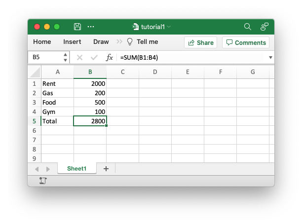

# Adding data to a worksheet

To add some sample expense data to a worksheet we could start with a simple
program like the following:

```rust
{{#rustdoc_include ../../../rust_xlsxwriter/examples/app_tutorial1.rs:7:}}

```

If we run this program we should get a spreadsheet that looks like this:



This is a simple program but it demonstrates some of the steps that would
apply to any rust_xlsxwriter program.

The first step is to create a new workbook object using the
[`Workbook`] constructor. [`Workbook::new`] takes one argument which is the
filename that we want to create:

[`Workbook`]: https://docs.rs/rust_xlsxwriter/latest/rust_xlsxwriter/struct.Workbook.html
[`workbook::new`]: https://docs.rs/rust_xlsxwriter/latest/rust_xlsxwriter/struct.Workbook.html#method.new


```rust
{{#rustdoc_include ../../../rust_xlsxwriter/examples/app_tutorial1.rs:14}}
```

**Note**, `rust_xlsxwriter` can only create new files. It cannot read or modify
existing files.

The workbook object is then used to add a new worksheet via the
[`add_worksheet`] method:

[`add_worksheet()`]: https://docs.rs/rust_xlsxwriter/latest/rust_xlsxwriter/struct.Workbook.html#method.add_worksheet


```rust
{{#rustdoc_include ../../../rust_xlsxwriter/examples/app_tutorial1.rs:17}}
```
The worksheet will have a standard Excel name, in this case "Sheet1". You can
specify the worksheet name using the [`worksheet.set_name()`] method.

[`worksheet.set_name()`]: https://docs.rs/rust_xlsxwriter/latest/rust_xlsxwriter/struct.Worksheet.html#method.set_name


We then iterate over the data and use the [`worksheet.write_string_only()`] and
[`worksheet.write_number_only()`] methods to write each row of our data:

[`worksheet.write_string_only()`]: https://docs.rs/rust_xlsxwriter/latest/rust_xlsxwriter/struct.Worksheet.html#method.write_string_only
[`worksheet.write_number_only()`]: https://docs.rs/rust_xlsxwriter/latest/rust_xlsxwriter/struct.Worksheet.html#method.write_number_only


```rust
{{#rustdoc_include ../../../rust_xlsxwriter/examples/app_tutorial1.rs:21:25}}
```

The `_only` part of the method names refers to the fact that the data type is
written without any formatting. We will see how to add formatting shortly.

Throughout rust_xlsxwriter rows and columns are zero indexed. So, for example,
the first cell in a worksheet, `A1`, is `(0, 0)`.

We then add a formula to calculate the total of the items in the second column:

```rust
{{#rustdoc_include ../../../rust_xlsxwriter/examples/app_tutorial1.rs:29}}
```

Finally, we close the Excel file via the [`workbook.close()`] method:

[`workbook.close()`]: https://docs.rs/rust_xlsxwriter/latest/rust_xlsxwriter/struct.Workbook.html#method.close


```rust
{{#rustdoc_include ../../../rust_xlsxwriter/examples/app_tutorial1.rs:32}}
```

This will give us the spreadsheet shown in the image above.
