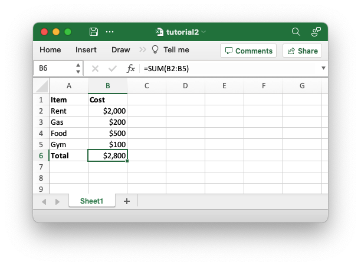

# Adding some formatting

The previous example converted the required data into an Excel file but it
looked a little bare. In order to make the information clearer we can add some
simple formatting, like this:




The differences here are that we have added "Item" and "Cost" column headers in
a bold font, we have formatted the currency in the second column and we have
made the "Total" string bold.

To do this programmatically we can extend our code as follows:

```rust
{{#rustdoc_include ../../../rust_xlsxwriter/examples/app_tutorial2.rs:8:}}
```

The main difference between this and the previous program is that we have added
two [Format] objects that we can use to format cells in the spreadsheet.

Format objects represent all of the formatting properties that can be applied to
a cell in Excel such as fonts, number formatting, colors and borders. This is
explained in more detail in the [Format] struct documentation.

[Format]: https://docs.rs/rust_xlsxwriter/latest/rust_xlsxwriter/struct.Format.html


For now we will avoid getting into the details of Format and just use a limited
amount of the its functionality to add some simple formatting:

```rust
{{#rustdoc_include ../../../rust_xlsxwriter/examples/app_tutorial2.rs:17:21}}
```

We can use these formats with the [`Worksheet::write_with_format()`] method which
writes data and formatting together, like this examples from the code:

```rust
{{#rustdoc_include ../../../rust_xlsxwriter/examples/app_tutorial2.rs:27}}
```

[`Worksheet::write_with_format()`]: https://docs.rs/rust_xlsxwriter/latest/rust_xlsxwriter/worksheet/struct.Worksheet.html#method.write_with_format

