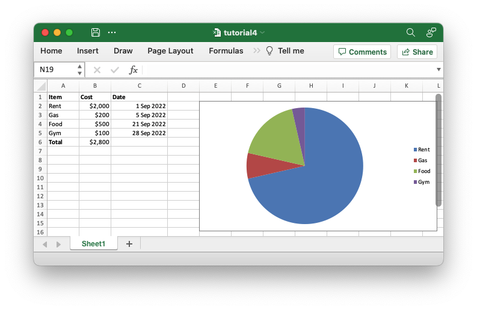

# Adding a chart

To extend our example a little further let's add a Pie chart to show the
relative sizes of the outgoing expenses to get a spreadsheet that will look like
this:



We use the [`Chart`] struct to represent the chart.

[`Chart`]: https://docs.rs/rust_xlsxwriter/latest/rust_xlsxwriter/struct.Chart.html

The [`Chart`] struct has a lot of configuration options and sub-structs to
replicate Excel's chart features but as an initial demonstration we will just
add the data series to which the chart refers. Here is the updated code with the
chart addition at the end.


```rust
{{#rustdoc_include ../../../rust_xlsxwriter/examples/app_tutorial4.rs:8:}}
```


See the documentation for [`Chart`] for more information.
