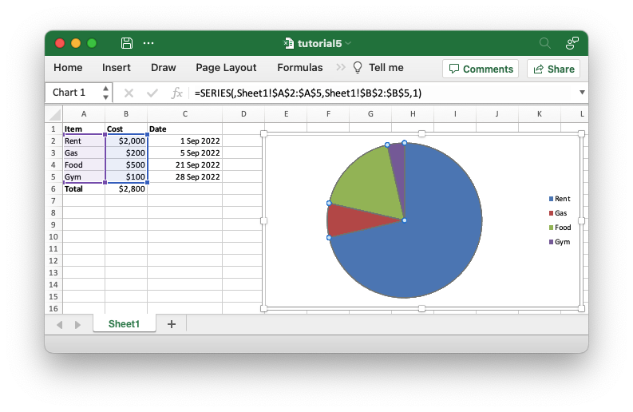

# Making the code more programmatic

The previous example worked as expected but it contains some hard-coded cell
ranges like `set_values("Sheet1!$B$2:$B$5")` and `Formula::new("=SUM(B2:B5)")`.
If our example changed to have a different number of data items then we would
have to manually change the code to adjust for the new ranges.

Fortunately, these hard-coded values are only used for the sake of a tutorial and
`rust_xlsxwriter` provides APIs to handle these more programmatically.

Let's start by looking at the chart ranges:


```rust
{{#rustdoc_include ../../../rust_xlsxwriter/examples/app_tutorial4.rs:62:65}}
```

In general `rust_xlsxwriter` always numeric APIs for any ranges in Excel but
sometimes also provides a **secondary** string based option. The previous
example uses the secondary string based API for demonstration purposes but for
real applications you would set the chart ranges we can using 5-tuple values
like this:

```rust
{{#rustdoc_include ../../../rust_xlsxwriter/examples/app_tutorial5.rs:72:75}}
```

Where the range values are set or calculated in the code:

```rust
{{#rustdoc_include ../../../rust_xlsxwriter/examples/app_tutorial5.rs:56:59}}
```

This allows the range to change dynamically if we add new elements to our `data`
vector and also ensures that the worksheet name is quoted properly, if required.

The other section of the code that has a hard-coded string is the formula
`"=SUM(B2:B5)"`. There isn't a single API change that can be applied to ranges
in formulas but `rust_xlsxwriter` provides several utility functions that can
convert numbers to string ranges. For example the
[`cell_range()`](crate::utility::cell_range) function which takes zero indexed
numbers and converts them to a string range like `B2:B5`:

```rust
{{#rustdoc_include ../../../rust_xlsxwriter/examples/app_tutorial5.rs:64:66}}
```

> **Reading ahead**:
>
> The `cell_range()` function and other similar functions are detailed elsewhere
> in the documentation:
>
> - [`column_number_to_name()`] - Convert a zero indexed column cell reference
>   to a string like `"A"`.
> - [`column_name_to_number()`] - Convert a column string such as `"A"` to a
>   zero indexed column reference.
> - [`row_col_to_cell()`] - Convert zero indexed row and column cell numbers to
>   a `A1` style string.
> - [`row_col_to_cell_absolute()`] - Convert zero indexed row and column cell
>   numbers to an absolute `$A$1` style range string.
> - [`cell_range()`] - Convert zero indexed row and col cell numbers to a
>   `A1:B1` style range string.
> - [`cell_range_absolute()`] - Convert zero indexed row and col cell numbers to
>   an absolute `$A$1:$B$1`

[`cell_range()`]: https://docs.rs/rust_xlsxwriter/latest/rust_xlsxwriter/fn.cell_range.html
[`row_col_to_cell()`]: https://docs.rs/rust_xlsxwriter/latest/rust_xlsxwriter/fn.row_col_to_cell.html
[`cell_range_absolute()`]: https://docs.rs/rust_xlsxwriter/latest/rust_xlsxwriter/fn.cell_range_absolute.html
[`column_number_to_name()`]: https://docs.rs/rust_xlsxwriter/latest/rust_xlsxwriter/fn.column_number_to_name.html
[`column_name_to_number()`]: https://docs.rs/rust_xlsxwriter/latest/rust_xlsxwriter/fn.column_name_to_number.html
[`row_col_to_cell_absolute()`]: https://docs.rs/rust_xlsxwriter/latest/rust_xlsxwriter/fn.row_col_to_cell_absolute.html

Adding these improvements our application changes to the following:

```rust
{{#rustdoc_include ../../../rust_xlsxwriter/examples/app_tutorial5.rs:8:}}
```

This gives the same output to the previous version but it is now future proof
for any changes to our input data:




