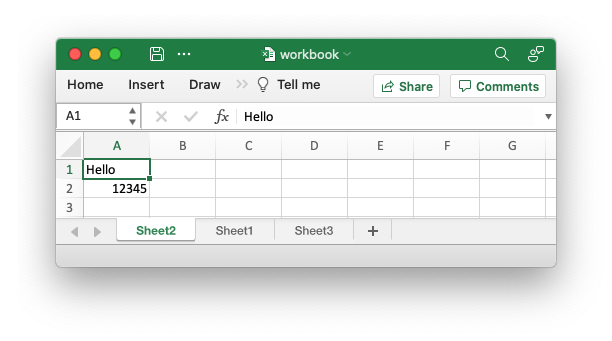

# Creating worksheets


There are two ways of creating a worksheet object with rust_xlsxwriter: via the
[`Workbook::add_worksheet()`] method and via the [`Worksheet::new()`] constructor.

The first method ties the worksheet to the workbook object that will
 automatically write it when the file is saved, whereas the second method
creates a worksheet that is independent of a workbook. The second method has
certain advantages in keeping the worksheet free of the workbook borrow checking
until needed, as explained below.

## Working with `add_worksheet()` and the borrow checker

Due to borrow checking rules you can only have one active reference to a
worksheet object created by [`Workbook::add_worksheet()`] since that method
always returns a mutable reference to an element of an internal vector.

For a workbook with multiple worksheets this restriction is generally workable
if you can create and use the worksheets sequentially since you will only need
to have one reference at any one time.

However, if you can’t structure your code to work sequentially then you can get
a reference to a previously created worksheet using
[`Workbook::worksheet_from_index()`]. The standard borrow checking rules still
apply so you will have to give up ownership of any other worksheet reference
prior to calling this method.

For example:

```rust
{{#rustdoc_include ../../../rust_xlsxwriter/examples/doc_workbook_worksheet_from_index.rs:12:27}}
```

You can also use [`Workbook::worksheet_from_name()`] to do something similar
using the worksheet names:

```rust
{{#rustdoc_include ../../../rust_xlsxwriter/examples/doc_workbook_worksheet_from_name.rs:12:29}}
```

Additionally can use [`Workbook::worksheets_mut()`] to get a reference to the the
vector that holds the worksheets. This can be used, for instance, to iterate
over all the worksheets in a workbook:

```rust
{{#rustdoc_include ../../../rust_xlsxwriter/examples/doc_workbook_worksheets_mut.rs:13:22}}
```

If you are careful you can use standard [slice] operations.

```rust
{{#rustdoc_include ../../../rust_xlsxwriter/examples/doc_workbook_worksheets_mut.rs:25}}
```

Combining the two previous examples would give an output file like the
following:



All three worksheets in the output file have the same data and `Sheet2` and
`Sheet1` have swapped position, as can be seen from the image.

## Working with `Worksheet::new()` and the borrow checker

As outlined in the introduction to this section it is also possible to create a
Worksheet object via [`Worksheet::new()`], as you would expect. Since this type
of Worksheet instance isn't tied to a Workbook it isn't subject to the
additional borrow checking rules that entails.

As such you can create and work with several Worksheet instances and then add
them to the Workbook when you are finished via the [`Workbook::push_worksheet()`]
method:

```rust
{{#rustdoc_include ../../../rust_xlsxwriter/examples/doc_worksheet_new.rs:11:28}}
```

## Using `add_worksheet()` versus  `Worksheet::new()`

Since there are two ways of doing, effectively, the same thing you will probably
wonder which is best.

The author mainly uses `add_worksheet()` and most of the library and
documentation examples are structured to work with that method. In addition, the
Excel xlsx file format has very tight coupling between it's sub-components and
it is possible that some future rust_xlsxwriter functionality will require
Worksheets and other Workbook objects to be `registered` with a parent Workbook
in order for them to work. However, there aren't currently any features like
that, and the author will seek to avoid them as much as possible.

One common use case that works better with `Worksheet::new()` and
`Workbook::push_worksheet()` is creating worksheets to run in a
parallelized/async mode. However, it is worth noting that there isn't a
guaranteed performance benefit from creating and working with worksheets in
parallelized/async mode since the main overhead comes from **writing** the
worksheets which will occur after the worksheets are joined back to the main
workbook `save()` thread. In addition `rust_xlsxwriter` already parallelizes the
writing of worksheets as much as possible.

So if the `Worksheet::new()` and `Workbook::push_worksheet()` methodology seems
more natural to you then you should use it.

[slice]: https://doc.rust-lang.org/1.64.0/std/primitive.slice.html
[`Worksheet::new()`]: https://docs.rs/rust_xlsxwriter/latest/rust_xlsxwriter/worksheet/struct.Worksheet.html#method.new
[`Workbook::add_worksheet()`]: https://docs.rs/rust_xlsxwriter/latest/rust_xlsxwriter/workbook/struct.Workbook.html#method.add_worksheet
[`Workbook::worksheets_mut()`]: https://docs.rs/rust_xlsxwriter/latest/rust_xlsxwriter/workbook/struct.Workbook.html#method.worksheets_mut
[`Workbook::push_worksheet()`]: https://docs.rs/rust_xlsxwriter/latest/rust_xlsxwriter/workbook/struct.Workbook.html#method.push_worksheet
[`Workbook::worksheet_from_name()`]: https://docs.rs/rust_xlsxwriter/latest/rust_xlsxwriter/workbook/struct.Workbook.html#method.worksheet_from_name
[`Workbook::worksheet_from_index()`]: https://docs.rs/rust_xlsxwriter/latest/rust_xlsxwriter/workbook/struct.Workbook.html#method.worksheet_from_index
