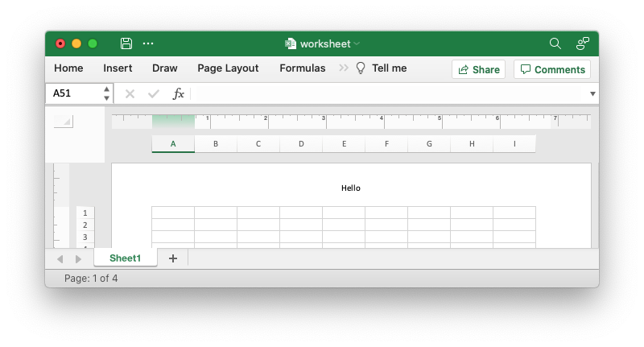
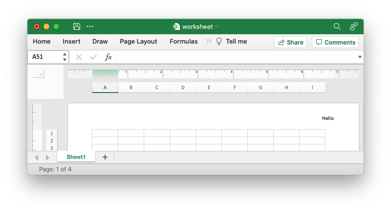
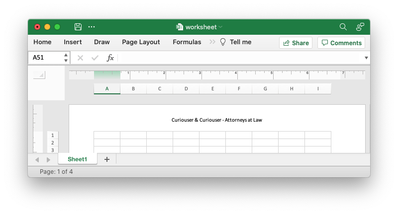
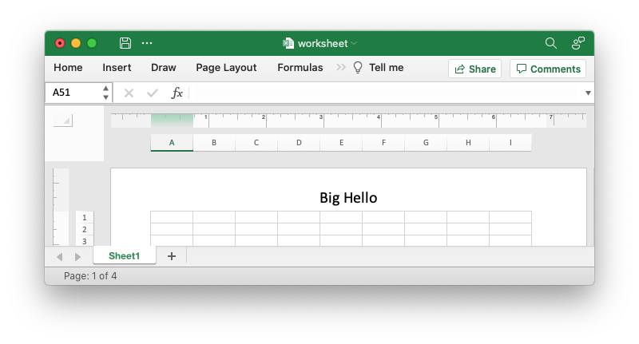
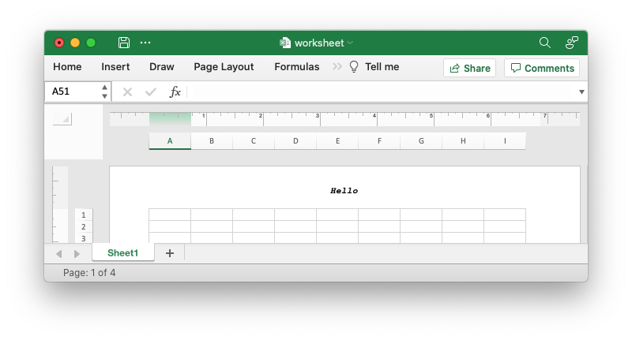

# Adding Headers and Footers


Headers and footers can be added to worksheets using the
[`worksheet.set_header()`] and [`worksheet.set_footer()`] methods.

[`worksheet.set_header()`]: https://docs.rs/rust_xlsxwriter/latest/rust_xlsxwriter/struct.Worksheet.html#method.set_header
[`worksheet.set_footer()`]: https://docs.rs/rust_xlsxwriter/latest/rust_xlsxwriter/struct.Worksheet.html#method.set_footer

Headers and footers are generated using a string which is a combination of plain
text and optional control characters.

The available control characters are:

| Control              | Category      | Description           |
| -------------------- | ------------- | --------------------- |
| `&L`                 | Alignment     | Left                  |
| `&C`                 |               | Center                |
| `&R`                 |               | Right                 |
| `&[Page]`  or `&P`   | Information   | Page number           |
| `&[Pages]` or `&N`   |               | Total number of pages |
| `&[Date]`  or `&D`   |               | Date                  |
| `&[Time]`  or `&T`   |               | Time                  |
| `&[File]`  or `&F`   |               | File name             |
| `&[Tab]`   or `&A`   |               | Worksheet name        |
| `&[Path]`  or `&Z`   |               | Workbook path         |
| `&fontsize`          | Font          | Font size             |
| `&"font,style"`      |               | Font name and style   |
| `&U`                 |               | Single underline      |
| `&E`                 |               | Double underline      |
| `&S`                 |               | Strikethrough         |
| `&X`                 |               | Superscript           |
| `&Y`                 |               | Subscript             |
| `&&`                 | Miscellaneous | Literal ampersand &   |

Some of the placeholder variables have a long version like `&[Page]` and a short
version like `&P`. The longer version is displayed in the Excel interface but
the shorter version is the way that it is stored in the file format. Either
version is okay since `rust_xlsxwriter` will translate as required.

Headers and footers have 3 edit areas to the left, center and right. Text can be
aligned to these areas by prefixing the text with the control characters `&L`,
`&C` and `&R`.

For example:

```rust
worksheet.set_header("&LHello");
```


```rust
worksheet.set_header("&CHello");
```


```rust
worksheet.set_header("&RHello");
```


You can also have text in each of the alignment areas:

```rust
worksheet.set_header("&LCiao&CBello&RCielo");
```


The information control characters act as variables/templates that Excel will
update/expand as the workbook or worksheet changes.

```rust
worksheet.set_header("&CPage &[Page] of &[Pages]");
```


Times and dates are in the user's default format:

```rust
worksheet.set_header("&CUpdated at &[Time]");
```


To include a single literal ampersand `&` in a header or footer you
should use a double ampersand `&&`:

```rust
worksheet.set_header("&CCuriouser && Curiouser - Attorneys at Law");
```


You can specify the font size of a section of the text by prefixing it with the
control character `&n` where `n` is the font size:

```rust
worksheet.set_header("&C&20Big Hello");
```



You can specify the font of a section of the text by prefixing it with the
control sequence `&"font,style"` where `fontname` is a font name such as Windows
font descriptions: "Regular", "Italic", "Bold" or "Bold Italic": "Courier New"
or "Times New Roman" and `style` is one of the standard Windows font
descriptions like “Regular”, “Italic”, “Bold” or “Bold Italic”:

```rust
worksheet.set_header(r#"&C&"Courier New,Bold Italic"Hello"#);
```


It is possible to combine all of these features together to create complex
headers and footers. If you set up a complex header in Excel you can transfer it
to `rust_xlsxwriter` by inspecting the string in the Excel file. For example the
following shows how unzip and grep the Excel XML sub-files on a Linux system.
The example uses libxml's xmllint to format the XML for clarity:

```text
$ unzip myfile.xlsm -d myfile
$ xmllint --format `find myfile -name "*.xml" | xargs` | \
    egrep "Header|Footer" | sed 's/&amp;/\&/g'

 <headerFooter scaleWithDoc="0">
   <oddHeader>&L&P</oddHeader>
 </headerFooter>
```

**Note**: Excel requires that the header or footer string be less than 256
characters, including the control characters. Strings longer than this
will not be written, and a warning will be output.