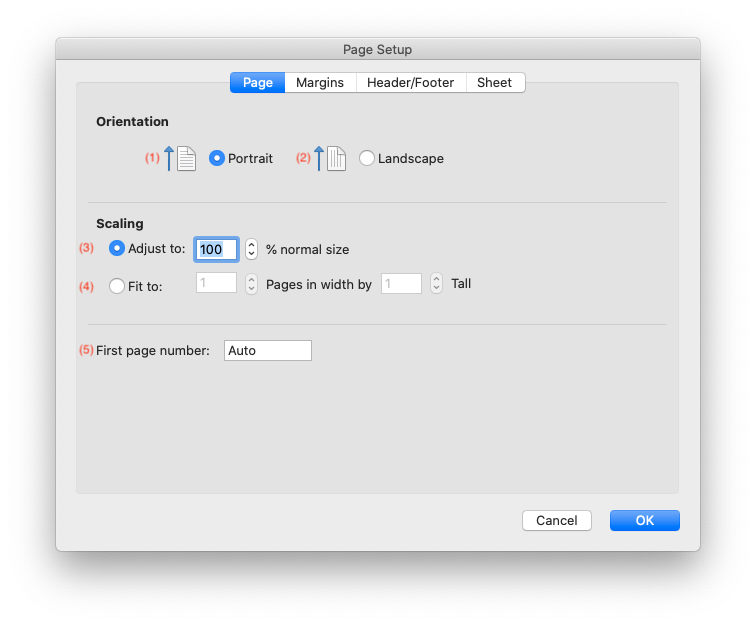
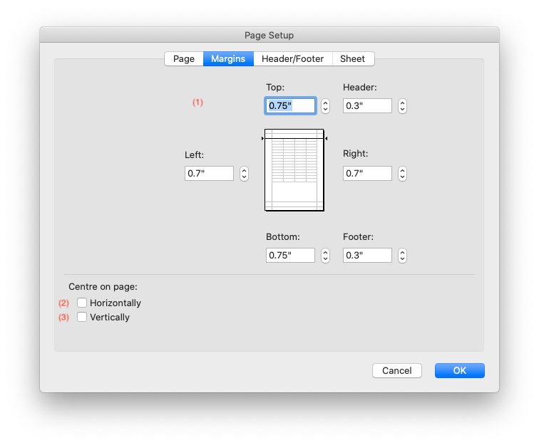
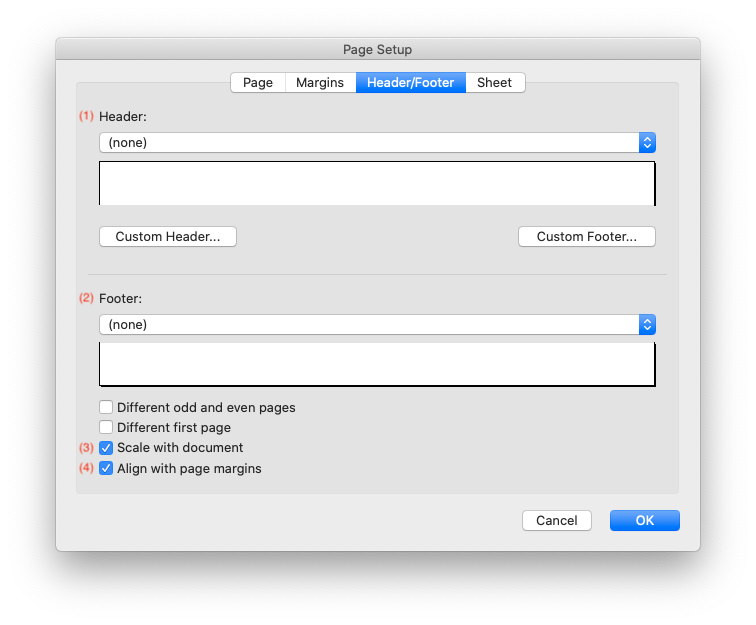
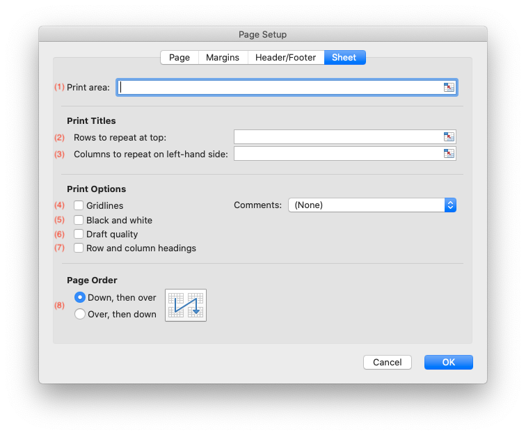

# Page Setup

The sections below look at the sections of the Excel Page Setup dialog and the
equivalent rust_xlsxwriter methods.

For more, general, information about the page setup options in Excel see the Microsoft documentation on [Page Setup].

[Page Setup]: https://support.microsoft.com/en-us/office/page-setup-71c20d94-b13e-48fd-9800-cedd1fec6da3

## Page Setup - Page

The page Setup "Page" dialog looks like this:



The equivalent rust_xlsxwriter methods are:

1. [`Worksheet::set_portrait()`]
2. [`Worksheet::set_landscape()`]
3. [`Worksheet::set_print_scale()`]
4. [`Worksheet::set_print_fit_to_pages()`]
5. [`Worksheet::set_print_first_page_number()`]

[`Worksheet::set_portrait()`]: https://docs.rs/rust_xlsxwriter/latest/rust_xlsxwriter/worksheet/struct.Worksheet.html#method.set_portrait
[`Worksheet::set_landscape()`]: https://docs.rs/rust_xlsxwriter/latest/rust_xlsxwriter/worksheet/struct.Worksheet.html#method.set_landscape
[`Worksheet::set_print_scale()`]: https://docs.rs/rust_xlsxwriter/latest/rust_xlsxwriter/worksheet/struct.Worksheet.html#method.set_print_scale
[`Worksheet::set_print_fit_to_pages()`]: https://docs.rs/rust_xlsxwriter/latest/rust_xlsxwriter/worksheet/struct.Worksheet.html#method.set_print_fit_to_pages
[`Worksheet::set_print_first_page_number()`]: https://docs.rs/rust_xlsxwriter/latest/rust_xlsxwriter/worksheet/struct.Worksheet.html#method.set_print_first_page_number

Note, for [`Worksheet::set_print_fit_to_pages()`] a common requirement is to fit
the printed output to `n` pages wide but have the height be as long as
necessary. To achieve this set the `height` to 0:

```rust
{{#rustdoc_include ../../../rust_xlsxwriter/examples/doc_worksheet_set_print_fit_to_pages.rs:18:19}}
```


## Page Setup - Margins

The page Setup "Margins" dialog looks like this:



The equivalent rust_xlsxwriter methods are:

1. [`Worksheet::set_margins()`]
2. [`Worksheet::set_print_center_horizontally()`]
3. [`Worksheet::set_print_center_vertically()`]

[`Worksheet::set_margins()`]: https://docs.rs/rust_xlsxwriter/latest/rust_xlsxwriter/worksheet/struct.Worksheet.html#method.set_margins
[`Worksheet::set_print_center_horizontally()`]: https://docs.rs/rust_xlsxwriter/latest/rust_xlsxwriter/worksheet/struct.Worksheet.html#method.set_print_center_horizontally
[`Worksheet::set_print_center_vertically()`]: https://docs.rs/rust_xlsxwriter/latest/rust_xlsxwriter/worksheet/struct.Worksheet.html#method.set_print_center_vertically


## Page Setup - Header/Footer

The page Setup "Header/Footer" dialog looks like this:



The equivalent rust_xlsxwriter methods are:

1. [`Worksheet::set_header()`]
2. [`Worksheet::set_footer()`]
3. [`Worksheet::set_header_footer_scale_with_doc()`]
4. [`Worksheet::set_header_footer_align_with_page()`]

[`Worksheet::set_header()`]: https://docs.rs/rust_xlsxwriter/latest/rust_xlsxwriter/worksheet/struct.Worksheet.html#method.set_header
[`Worksheet::set_footer()`]: https://docs.rs/rust_xlsxwriter/latest/rust_xlsxwriter/worksheet/struct.Worksheet.html#method.set_footer
[`Worksheet::set_header_footer_scale_with_doc()`]: https://docs.rs/rust_xlsxwriter/latest/rust_xlsxwriter/worksheet/struct.Worksheet.html#method.set_header_footer_scale_with_doc
[`Worksheet::set_header_footer_align_with_page()`]: https://docs.rs/rust_xlsxwriter/latest/rust_xlsxwriter/worksheet/struct.Worksheet.html#method.set_header_footer_align_with_page

Headers and footers are explained in more detail in the next section on [Adding
Headers and Footers](headers.md).

Note, the options for different first, odd and even pages are not supported in
rust_xlsxwriter.

## Page Setup - Sheet

The page Setup "Sheet" dialog looks like this:



The equivalent rust_xlsxwriter methods are:

1. [`Worksheet::set_print_area()`]
2. [`Worksheet::set_repeat_rows()`]
3. [`Worksheet::set_repeat_columns()`]
4. [`Worksheet::set_print_gridlines()`]
5. [`Worksheet::set_print_black_and_white()`]
6. [`Worksheet::set_print_draft()`]
7. [`Worksheet::set_print_headings()`]
8. [`Worksheet::set_page_order()`]

[`Worksheet::set_print_area()`]: https://docs.rs/rust_xlsxwriter/latest/rust_xlsxwriter/worksheet/struct.Worksheet.html#method.set_print_area
[`Worksheet::set_repeat_rows()`]: https://docs.rs/rust_xlsxwriter/latest/rust_xlsxwriter/worksheet/struct.Worksheet.html#method.set_repeat_rows
[`Worksheet::set_repeat_columns()`]: https://docs.rs/rust_xlsxwriter/latest/rust_xlsxwriter/worksheet/struct.Worksheet.html#method.set_repeat_columns
[`Worksheet::set_print_gridlines()`]: https://docs.rs/rust_xlsxwriter/latest/rust_xlsxwriter/worksheet/struct.Worksheet.html#method.set_print_gridlines
[`Worksheet::set_print_black_and_white()`]: https://docs.rs/rust_xlsxwriter/latest/rust_xlsxwriter/worksheet/struct.Worksheet.html#method.set_print_black_and_white
[`Worksheet::set_print_draft()`]: https://docs.rs/rust_xlsxwriter/latest/rust_xlsxwriter/worksheet/struct.Worksheet.html#method.set_print_draft
[`Worksheet::set_print_headings()`]: https://docs.rs/rust_xlsxwriter/latest/rust_xlsxwriter/worksheet/struct.Worksheet.html#method.set_print_headings
[`Worksheet::set_page_order()`]: https://docs.rs/rust_xlsxwriter/latest/rust_xlsxwriter/worksheet/struct.Worksheet.html#method.set_page_order
