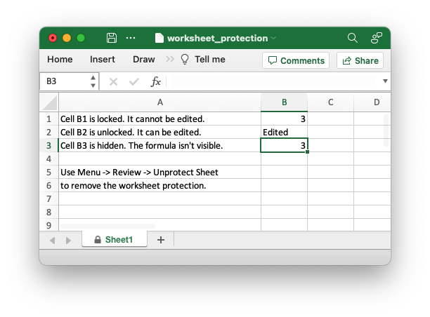

# Worksheet protection

It is occasionally necessary to lock all or parts of a worksheet to prevent
unintentional editing. For example you may have certain fields that you want a
user to update but have other instruction or calculation cells that you don't
want modified.

In Excel you do this by turning on the "*Review -> Sheet Protect*" option and in
`rust_xlsxwriter` you can use the [`Worksheet::protect()`] method:

```rust
{{#rustdoc_include ../../../rust_xlsxwriter/examples/app_worksheet_protection.rs:22}}
```

Here is a more complete example:

```rust
{{#rustdoc_include ../../../rust_xlsxwriter/examples/app_worksheet_protection.rs:8:}}
```

The key parts of this example are:

- In Excel all cells have a default "locked" format so once a worksheet is
  protected the cells cannot be changed.
- To allow some cells to be edited you can set a "unlocked" format.
- You can also "hide" formulas in a protected worksheet.

The output from the program will look like the following. Note that cell "B2",
which was unlocked in the example, has been edited.



And this is the alert you get if you try to edit a locked cell.


## Setting a protection password

You can deter a user from turning off worksheet protection by adding a worksheet
level password using the [`Worksheet::protect_with_password()`] method:

```rust
{{#rustdoc_include ../../../rust_xlsxwriter/examples/doc_worksheet_protect_with_password.rs:16:17}}
```

This gives the following dialog when the user tries to unprotect the worksheet.


**Note**: Worksheet level passwords in Excel offer **very weak protection**.
They do not encrypt your data and are very easy to deactivate. Full workbook
encryption is not supported by `rust_xlsxwriter`. See the section on [Workbook
Protection](#workbook-protection) below.

## Choosing which worksheet elements to protect

Excel allows you to control which objects or actions on the worksheet that are
protected. The default Excel options are:


Almost all the options are protected by default apart from "Select locked cells"
and "Select unlocked cells".

If you wish to turn on or off any of these options you can use the
[`ProtectionOptions`] struct and the [`Worksheet::protect_with_options()`]
method. For example:


```rust
{{#rustdoc_include ../../../rust_xlsxwriter/examples/doc_worksheet_protect_with_options.rs:17:25}}
```

This changes the allowed options to:


## Workbook protection

As noted above `rust_xlsxwriter` doesn't provide workbook level
encryption/protection and it is unlikely that it will be added.

However, it is possible to encrypt an rust_xlsxwriter file using a third party
open source tool called [msoffice-crypt]. This works for macOS, Linux and
Windows:

```text
msoffice-crypt.exe -e -p password clear.xlsx encrypted.xlsx
```

## Read-only workbook

If you wish to have an Excel workbook open as read-only by default then you can
use the [`Workbook::read_only_recommended()`] method:

```rust
{{#rustdoc_include ../../../rust_xlsxwriter/examples/doc_workbook_read_only_recommended.rs:15}}
```

This presents the user of the file with an option to open it in "read-only"
mode. This means that any changes to the file can’t be saved back to the same
file and must be saved to a new file.

The alert looks like this:


[msoffice-crypt]: https://github.com/herumi/msoffice
[`Worksheet::protect()`]: https://docs.rs/rust_xlsxwriter/latest/rust_xlsxwriter/worksheet/struct.Worksheet.html#method.protect
[`ProtectionOptions`]: https://docs.rs/rust_xlsxwriter/latest/rust_xlsxwriter/struct.ProtectionOptions.html
[`Worksheet::protect_with_options()`]: https://docs.rs/rust_xlsxwriter/latest/rust_xlsxwriter/worksheet/struct.Worksheet.html#method.protect_with_options
[`Workbook::read_only_recommended()`]: https://docs.rs/rust_xlsxwriter/latest/rust_xlsxwriter/workbook/struct.Workbook.html#method.read_only_recommended
[`Worksheet::protect_with_password()`]: https://docs.rs/rust_xlsxwriter/latest/rust_xlsxwriter/worksheet/struct.Worksheet.html#method.protect_with_password


